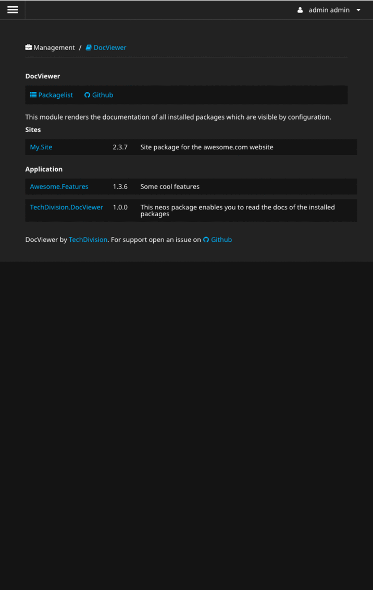

# TechDivision.DocViewer

This Neos package provides a backend module which renders Markdown in the "Documentation" 
folder of all installed packages. The idea is Neos.Editors are able to read a project 
specific manual about the project.

For examle in your Neos site are some complex editing or configuration features for the 
Neos.Editors. With this module are you able to provide them a manuel for your project.

**Why not reStructuredText?** 

At this point there is no stable php solution rendering RST especially the Neos docs. 
To avoid complex dependencies this project supports only Markdown yet.

## Features

- List installed packages with documentation
- Rendering markdown with common features
- Configurable blacklist to hide packages
- Configurable default packages

## TBD

- configurable optional sub-directory inside the Documentation directory for rendering 
to enable the possibility for a developer documentation and an user manual
- branched version for LTS and current Neos version